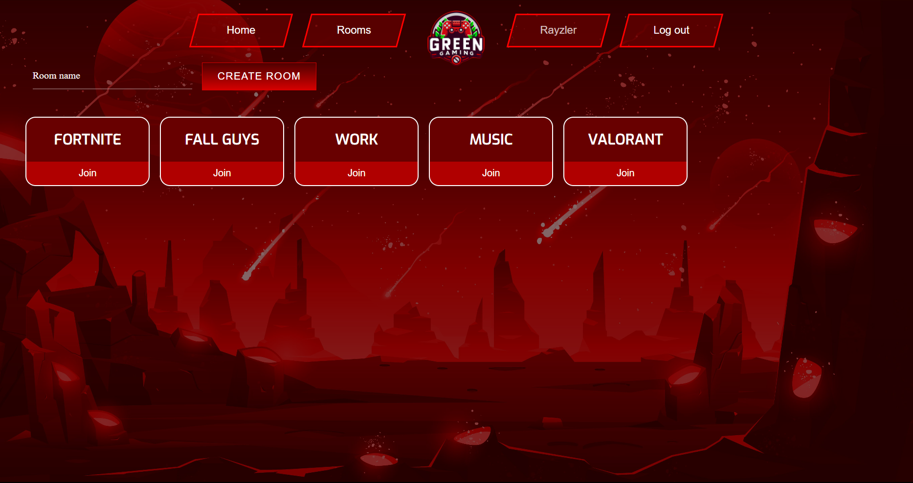
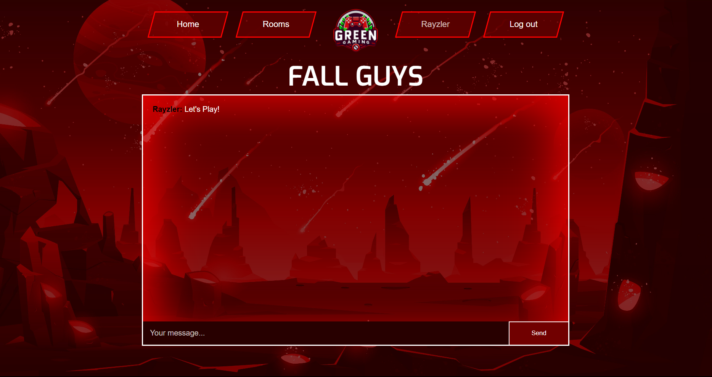

<!-- ABOUT THE PROJECT -->
# Chat Channels

Una plataforma de comunicación que permite a los usuarios interactuar en tiempo real a través de salas de chat dedicadas gracias a la funcionalidad de Django Channels. 

Ofrece a los usuarios la posibilidad de crear, unirse y participar en diferentes salas de chat según sus intereses o necesidades.

Además, la aplicación cuenta con un sistema de autenticación que permite a los usuarios registrarse e iniciar sesión.


### Características

* Creación de Salas de Chat
* Unión a Salas Existentes
* Mensajería en Tiempo Real
* Gestión de Usuarios
* Historial de Mensajes

### Tecnologías

El proyecto se fundamenta en Django para la construcción de la aplicación web. Para habilitar funcionalidades de chat en tiempo real, se usa Django Channels, una extensión de Django que facilita la comunicación bidireccional basada en websockets.

* [![Python][Python.io]][Python-url]
* [![Django][Django.io]][Django-url]
* [![Sqlite][Sqlite.io]][Sqlite-url]

<!-- GETTING STARTED -->
## Getting Started

### Requisitos previos

* Python
* Code editor (VS Code, Sublime Text, etc.)

### Configuración

1. Clonar el repositorio
   ```sh
   git clone https://github.com/Rayzler/Chat-Channels.git
   ```
2. Instalar los paquetes necesarios
   ```sh
   pip install -r requirements.txt
   ```
3. Crear las migraciones de los modelos a Sqlite
   ```sh
   python manage.py makemigrations roomApp
   ```
4. Realizar la migración
   ```sh
   python manage.py migrate      
   ```
5. Ejecutar el servidor en el puerto 8080
    ```sh
    python manage.py runserver 8080
   ```

<!-- USAGE EXAMPLES -->
## Usos

1. Acceda a la aplicación en la URL http://localhost:8080.
2. Si no está registrado, haga clic en el botón "Sign up" para crear una cuenta.
   
3. Una vez autenticado, podrá acceder a las salas y crear o unirse a una existente.
   
4. Dentro de la sala podra chatear en tiempo real con los usuarios que esten en la misma sala.
   

<!-- MARKDOWN LINKS & IMAGES -->
[Python.io]: https://img.shields.io/badge/Python-3972a1?style=for-the-badge&logo=python&logoColor=ffd342
[Python-url]: https://www.python.org
[Django.io]: https://img.shields.io/badge/Django-092E20?style=for-the-badge&logo=django&logoColor=green
[Django-url]: https://www.djangoproject.com
[Sqlite.io]: https://img.shields.io/badge/sqlite-083c54?style=for-the-badge&logo=sqlite&logoColor=73c2ec
[Sqlite-url]: https://www.sqlite.org
